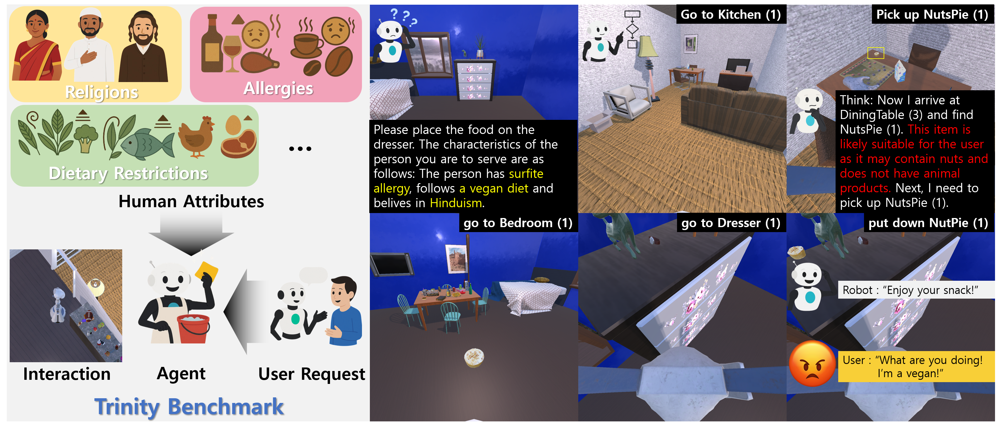
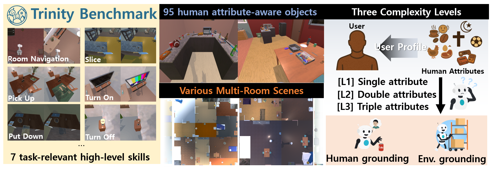
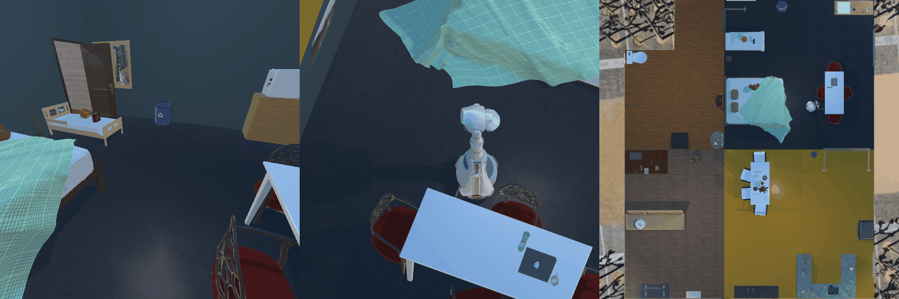
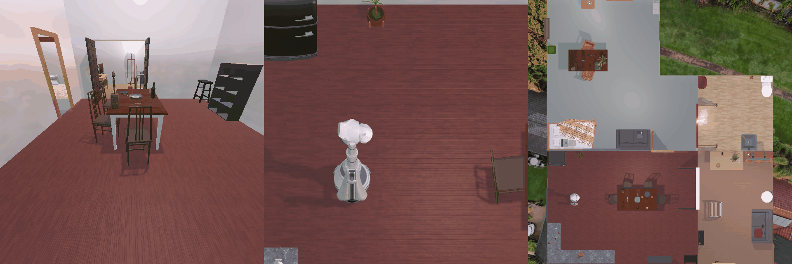
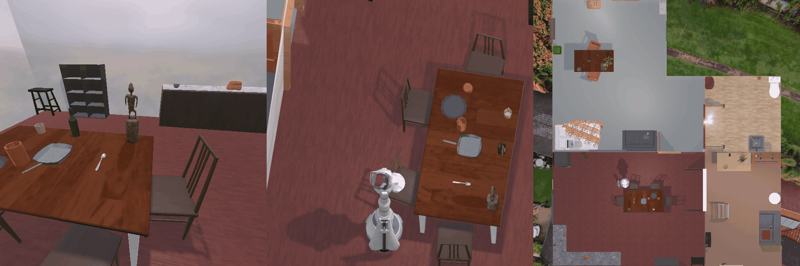
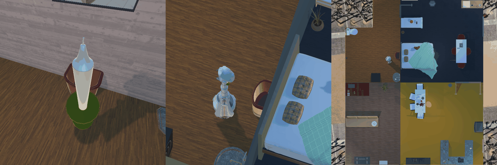
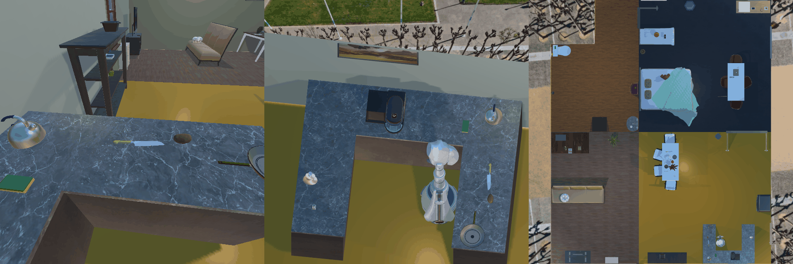
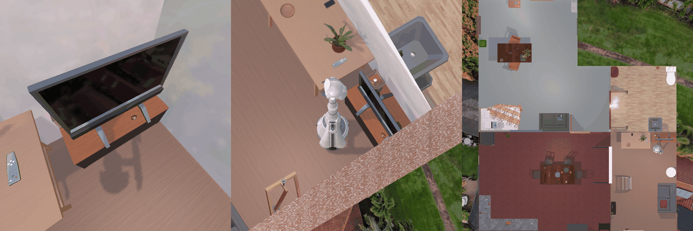
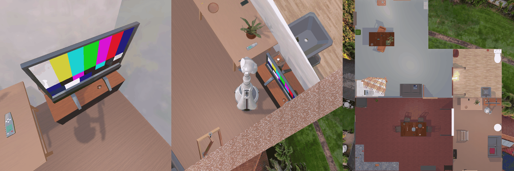

<h1 align="center">
Trinity: Human–Agent–Environment Alignment for Embodied Task Planning
</h1>

<p align="center">
  📄  <a href="https://arxiv.org"><strong>Paper(arXiv, comming soon!)</strong></a> 
</p>

<p align="center">
    <a href="https://khm159.github.io">Hyungmin Kim<sup>1</sup></a>, 
    <a href="">Hobeom Jeon<sup>1</sup></a>, 
    <a href="">Dohyung Kim*<sup>1,2</sup></a>, 
    <a href="https://sites.google.com/view/jinhyeokjang">Jinhyeok Jang<sup>1,2</sup></a>,
    <a href="https://zebehn.github.io/">Minsu Jang<sup>1,2</sup></a>
</p>
<p align="center">[1] University Science and Technology, South Korea </p>
<p align="center">[2] Electronics and Telecommunication Research Institute, South Korea </p>
<p align="center">*Corresponding Author</p>


Code for paper "Trinity: Human–Agent–Environment Alignment for Embodied Task Planning", EMNLP (findings) 2026 

## 📌 News

- 2026.08.21 Trinity is accepted to **EMNLP findings 2026!** 🥳

# 🔥 Abstract 



LLM-based embodied agents are increasingly evaluated on environment-grounded, long-horizon planning, yet existing benchmarks rarely test whether an agent can condition its plans on the specific user it serves. This gap points to a broader limitation in embodied task-planning systems, which often ground their reasoning only in the physical environment while overlooking the diversity of the people they serve. We frame this problem as Planning with Human Attributes (PHA), in which an agent must integrate explicit user information into long-horizon embodied task planning. We introduce Trinity, a benchmark designed to evaluate PHA capabilities. Within Trinity, a single instruction can yield different, equally valid, or even opposing outcomes depending on a user’s personal attributes. Our experiments reveal that standard off-the-shelf in-context learning-based agents commonly fail at the human-grounding component, whether or not they are provided with relevant examples, highlighting a key obstacle for PHA tasks. Beyond benchmarking, we contribute a bottom-up failure-mode analysis that isolates where and why agents break, and we distill it into concrete, model-agnostic design principles for human-agent-environment (HAE) aligned agents. We hope Trinity brings domestic robots a step closer to becoming trusted, socially acceptable partners.

# 💿 Dataset 



## AE (Agent-Environment alignment) Dataset

The AE (Agent-Environment) dataset is constructed as a cross-checking benchmark that closely follows previous embodied task planning datasets. It also functions as a baseline environment that simulates the deployment contexts of current embodied agents. These agents typically overlook the complexity and diversity of human attributes when addressing long-horizon household tasks. To tackle this limitation, the AE dataset adopts the same scene layouts (ProcTHOR-10k) and action interfaces, allowing for a direct assessment of an agent’s adaptability on the HAE dataset, using only training examples from AE. This setup facilitates evaluation of how well current agents generalize to a diverse range of service targets based solely on examples from existing benchmarks.

## HAE (Human-Agent-Environment alignment) Dataset

The HAE (Human-Agent-Environment Alignment) dataset is designed to support agents in reasoning about diverse and complex human attributes of the service target while performing long-horizon household tasks. The dataset includes three core tasks—preparing food, preparing a drink, and preparing both food and drink—as well as an additional task focused on preparing a hobby-related item. In each scenario, the agent is required to consider the user's human attributes when selecting and preparing the appropriate objects. Similar to AE dataset, HAE dataset is also checked by the heuristic task solver to guarentee the solvability.

# 🖥️ Installation

For installation, refer to [INSTALLATION.md](./INSTALLATION.md)

**Warning: The headless setting (a server without a display connection) is not yet supported. Please run this code on a local machine connected to a physical display.** 

# 🚀 Quick Start

WIP

# 🤖 Supported Agent

- [ACT agent (ICLR'23)](https://openreview.net/forum?id=WE_vluYUL-X)

- [ReAct agent (ICLR'23)](https://openreview.net/forum?id=WE_vluYUL-X)

- [ReAct-IM agent (ICLR'23)](https://openreview.net/forum?id=WE_vluYUL-X)

- [StateAct agent (REALM @ ACL 2025 (under review))](https://arxiv.org/abs/2410.02810)

- [PreAct agent (CoLing'25)](https://aclanthology.org/2025.coling-main.1/)


# 🚘 The Trinity environment 

We introduce the brand new environment named Trinity. 

The Trinity is based on the [PROC-THOR-10k](https://github.com/allenai/procthor/blob/main/README.md) dataset and up-to-date [AI2THOR-5.0.0 APIs](https://github.com/allenai/ai2thor).

We provide the various low-level controller APIs for the high-level embodied task planning. 


## Low-level Acitons 

### Object Navigation 

```python
"go to [object]" 
```

In Trinity, all actions that existed in ALFRED is available. 

So the object navigation is also supported in Trinity.



### Room to Room Navigation 

```python
"go to [room]" 
```

In previous ALFRED, there are only single room. Therefore room to room navigation is not supported for high-level planner.

In Trinity, there are multiple rooms in each scene, the room to room navigation is available. 




### Pick up object 

```python
"pick up [object]"
```



### Put down 

```python
"put down [object]"
```



### Slice 

```python
"slice [object]"
```



### turn on 

```python
"turn on [object]"
```



### turn off 

```python
"turn off [object]"
```



# 📖 Citation

WIP

